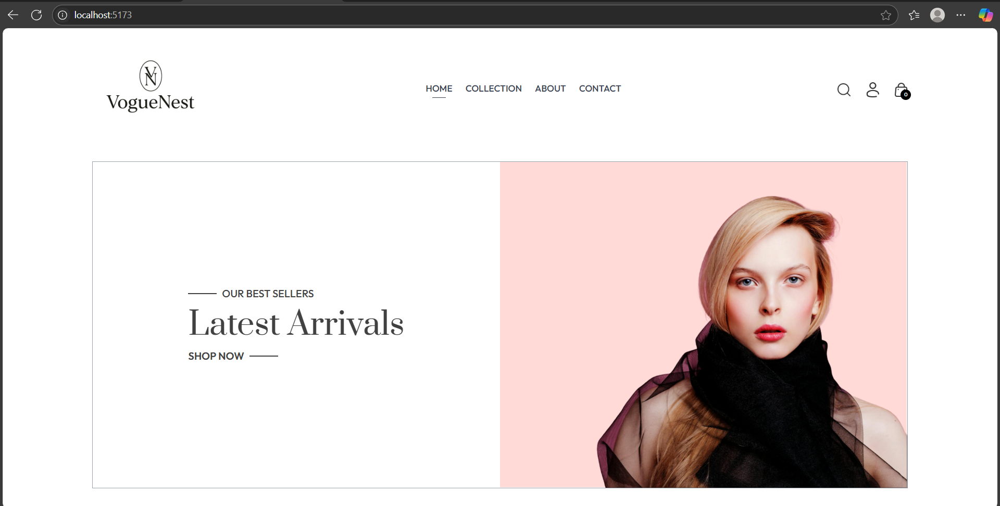
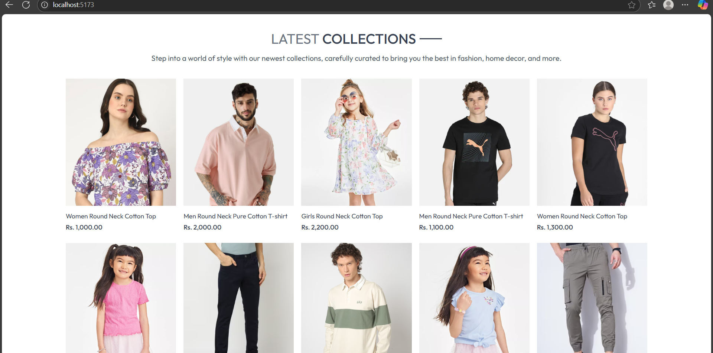
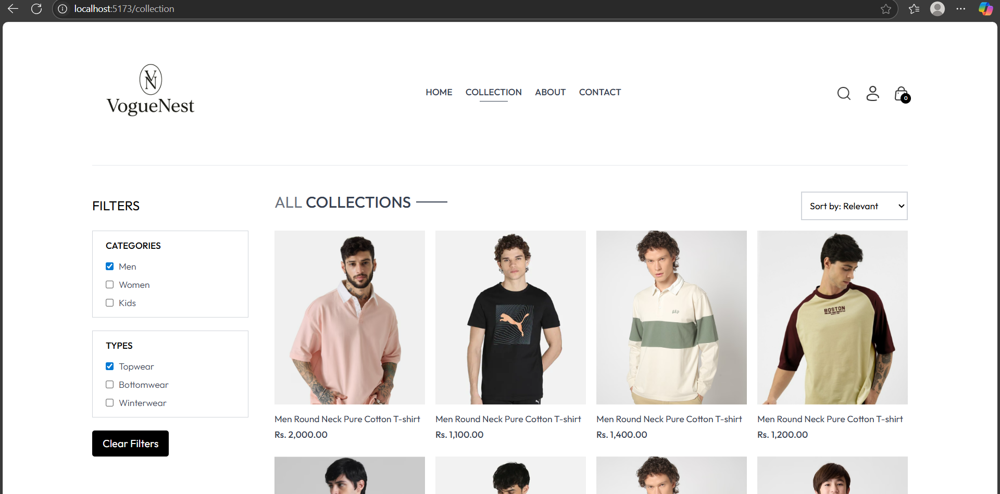
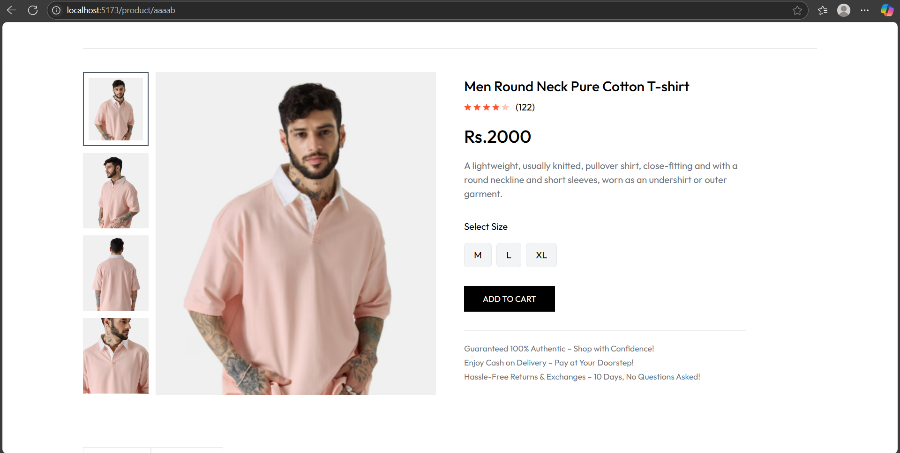
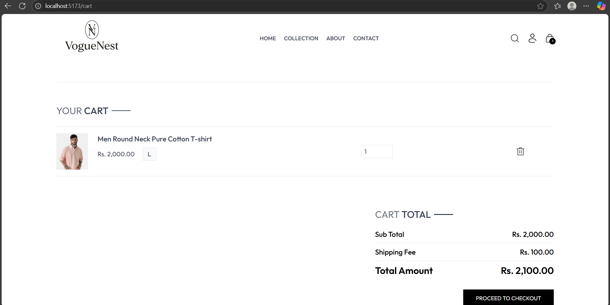
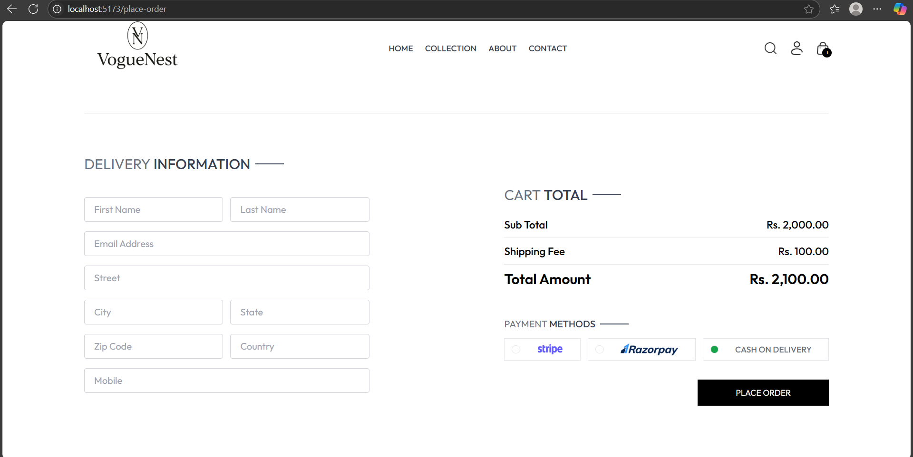
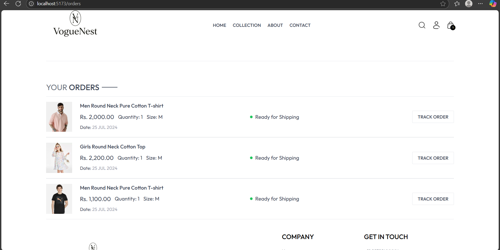

👗 VogueNest

A modern fashion e-commerce platform where style meets quality. Discover the latest trends and curate your perfect wardrobe with our carefully selected collections.

📸 Screenshots

🏠Homepage Hero Section

Elegant hero section showcasing latest arrivals

🛍️Product Collections

Curated collections with diverse fashion options

🛍️Product Catalog

Advanced filtering and sorting capabilities

📦Product Details

Detailed product views with multiple images and size selection

🛒Shopping Cart

Clean cart interface with order summary

🧾Checkout Process

Streamlined checkout with multiple payment options

🧑‍💼Order Tracking and Management

<h2>✨ Features</h2>
<ul>
  <li>🎨 <strong>Modern UI/UX</strong> – Clean, fashion-forward design with elegant typography</li>
  <li>👕 <strong>Product Management</strong> – Complete catalog with categories, filters, and search</li>
  <li>🛒 <strong>Shopping Cart</strong> – Seamless add-to-cart and checkout experience</li>
  <li>💳 <strong>Multiple Payment Options</strong> – Stripe, Razorpay, and Cash on Delivery</li>
  <li>🔐 <strong>Admin Dashboard</strong> – Comprehensive admin panel for inventory management</li>
  <li>⭐ <strong>Product Reviews</strong> – Customer rating and review system</li>
  <li>🚚 <strong>Order Tracking</strong> – Real-time order status updates</li>
  <li>🎯 <strong>Advanced Filtering</strong> – Filter by category, type, price, and more</li>
  <li>💌 <strong>Newsletter Subscription</strong> – Email marketing integration</li>
  <li>🔒 <strong>Secure Authentication</strong> – JWT-based user authentication</li>
</ul>

<h2>🛠️ Tech Stack</h2>

<h3>Frontend (User Store):</h3>
<ul>
  <li>React.js 18</li>
  <li>CSS3 with modern styling</li>
  <li>Responsive Grid Layout</li>
  <li>React Router for navigation</li>
</ul>

<h3>Backend:</h3>
<ul>
  <li>Node.js</li>
  <li>Express.js</li>
  <li>RESTful API architecture</li>
  <li>JWT Authentication</li>
</ul>

<h3>Database & Storage:</h3>
<ul>
  <li>MongoDB / MySQL</li>
  <li>Image storage solution</li>
  <li>Session management</li>
</ul>

<h3>Payment Integration:</h3>
<ul>
  <li>Stripe Payment Gateway</li>
  <li>Razorpay Integration</li>
  <li>Cash on Delivery option</li>
</ul>

<h3>Tools & Services:</h3>
<ul>
  <li>Git version control</li>
  <li>Environment configuration</li>
  <li>API documentation</li>
</ul>

<h2>📁 Project Structure</h2>

<pre>
<code>
voguenest/
├── admin/             # Admin dashboard built with React.js
│   ├── src/
│   ├── public/
│   ├── package.json
│   └── README.md
├── backend/           # Node.js backend with Express.js
│   ├── routes/
│   ├── models/
│   ├── middleware/
│   ├── controllers/
│   ├── config/
│   └── server.js
├── frontend/          # User-facing React.js storefront
│   ├── src/
│   ├── public/
│   ├── package.json
│   └── README.md
├── .gitignore
└── README.md
</code>
</pre>

<h2>🔮 Future Enhancements</h2>
<ul>
  <li>📱 <strong>Mobile App Development</strong></li>
  <li>🤖 <strong>AI-Powered Product Recommendations</strong></li>
  <li>🌍 <strong>Multi-Language Support</strong></li>
  <li>📦 <strong>Advanced Inventory Forecasting</strong></li>
  <li>🎨 <strong>AR Try-On Features</strong></li>
  <li>💬 <strong>Live Chat Support</strong></li>
  <li>🔔 <strong>Push Notifications</strong></li>
  <li>📈 <strong>Advanced Analytics Dashboard</strong></li>
</ul>

👨‍💻 Author

TARANPREET SINGH

GitHub:@Taranpreet317

  <strong>⭐ Star this repo if you find it helpful! ⭐</strong>
  
VogueNest - Where Fashion Meets Technology 👗✨

